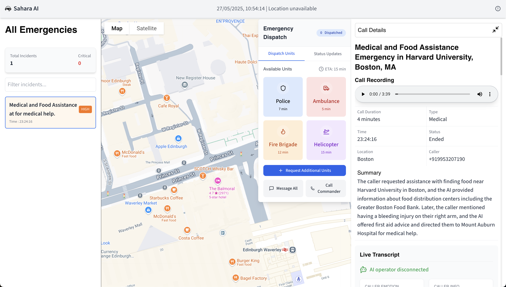

# Sahara AI – Emergency Response Dashboard

**Sahara AI** is an AI-powered emergency response dashboard designed to revolutionize how emergency calls are managed, analyzed, and dispatched. Built for hackathons and real-world impact, Sahara AI leverages intelligent automation to bridge the gap in critical moments—when every second counts.

---

## 🚨 Problem

Emergency call centers are overwhelmed and understaffed, leading to:
- Delayed response times
- Overworked operators
- Increased risk of critical errors

**Sahara AI** addresses these challenges with a modern, data-driven, and AI-augmented solution.

---

##  Features

- **Live Emergency Dashboard:**  
  Visualize all active emergency calls and their locations on an interactive map.

- **AI-Powered Call Analysis:**  
  Each call is analyzed in real-time for severity, category, risk, and recommended actions using advanced AI.

- **Incident Management:**  
  View, filter, and interact with incidents directly on the dashboard.

- **Live Transcript & Emotion Detection:**  
  See live transcripts of emergency calls and real-time caller emotion analysis.

- **Automated Dispatch:**  
  Instantly triage and dispatch resources based on AI recommendations.

- **Modern UI:**  
  Responsive, accessible, and visually engaging interface built with Next.js and Tailwind CSS.

---

## 🖥️ Screenshots




---

## 🚀 Getting Started

### Prerequisites

- Node.js (v18+ recommended)
- npm or yarn
- Google Maps API Key (for map features)

### Installation

1. **Clone the repository:**
   ```bash
   git clone https://github.com/yourusername/sahara-ai.git
   cd sahara-ai/frontend
   ```

2. **Install dependencies:**
   ```bash
   npm install
   # or
   yarn install
   ```

3. **Set up environment variables:**
   - Create a `.env.local` file in the `frontend` directory.
   - Add your Google Maps API key:
     ```
     NEXT_PUBLIC_GOOGLE_MAPS_API_KEY=your_google_maps_api_key
     ```

4. **Run the development server:**
   ```bash
   npm run dev
   # or
   yarn dev
   ```

5. **Open your browser:**  
   Visit [http://localhost:3000](http://localhost:3000) to view the dashboard.

---

## 🗺️ Project Structure

```
frontend/
├── src/
│   ├── components/         # Reusable React components
│   │   ├── DashboardCompo/ # Dashboard-specific components (Map, Sidebar, Transcript, etc.)
│   │   └── ProblemSolution.tsx
│   ├── app/                # Next.js app directory
│   └── public/             # Static assets (images, icons, etc.)
├── package.json
├── tailwind.config.ts
└── ...
```

---

## ⚙️ Key Technologies

- **Next.js** – React framework for server-side rendering and routing
- **Tailwind CSS** – Utility-first CSS for rapid UI development
- **Google Maps API** – Interactive mapping and geolocation
- **TypeScript** – Type-safe, scalable codebase
- **Custom AI Service** – For emergency call analysis (see `/lib/gemini.service`)

---

## 🧑‍💻 For Hackathons

- Demo-ready UI with real-time features
- Easy to extend with new data sources or AI models
- Clean, modular code for rapid iteration

---

## 🙌 Contributing

Pull requests are welcome! For major changes, please open an issue first to discuss what you would like to change.

---

## 📄 License

MIT License

---

## 📞 Contact

For questions or demo requests, contact [your-email@example.com].

---

**Sahara AI – Because every second counts.**
